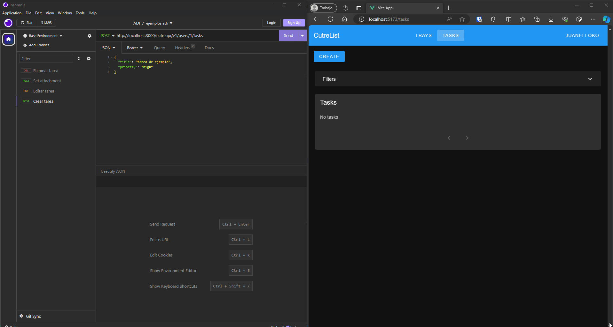

# VUE Practice

## Minimum Requirements

### Login Logout

On the client side, the `loggedUser` store has been created. This store contains the necessary methods for logging in, registering, and logging out. Since tokens can expire, a task is created upon login that will automatically log out when the token expires.

### Item Listing

When the application starts, all trays are fetched from the server using the trays store. On the `/trays` URL associated with the `trays/TraysView` view, all trays are listed.

### Item Creation

The `trays/TraysView` view contains a form that allows the creation of a new tray. This form validates that at least a name is provided for the tray.

### Deleting, Editing, and Viewing Item Details

The `trays/TraysView` view is composed of several `trays/TrayCard` components. This component can be in several states, and depending on the state, it will display different information.

The possible states of this component are:


If the component is in the `DISPLAYING` state, it will show basic information about the tray, including the name and description, along with three buttons. The first button is used to delete the tray, the second displays a modal with more information about the tray, such as the creation date and last edited date, and the third button allows for editing the tray, ensuring a name is provided for the tray.

## Additional Requirements

### Data Pagination and Search

Pagination and data filtering have been implemented in a component responsible for listing the tasks. This component is `tasks/PaginatedTaskList`, which uses page-based and scroll-based pagination. Every time the page is changed, the tasks for that page are requested from the server. If the number of tasks to display or any filter changes, the pagination returns to page 1.

### Animations

Animations have been implemented in two parts of the application:

1. The login form shakes if the credentials are incorrect.
2. In the `trays/TraysView`, when a tray is deleted, it fades out and disappears downwards.

### Component Framework

The entire graphical interface of the application was built using several components from [Vuetify](https://vuetifyjs.com/en/).

### Vue Router

Vue Router has been used to manage the application's navigation, as well as protect views that require the user to be logged in. You can see this in the `router/index.js` file on the client side.

### Listing Another Resource, Viewing Details, Deleting, and Editing

Task listing has been implemented to fulfill this point, as well as its pagination. The listing is done in the paginated component mentioned earlier, while viewing details, deleting, and editing follow a similar structure to the tray system. The `tasks/TaskCard` component can be in various states, and depending on the state, it displays different information. The main difference is that since tasks have many more attributes than trays, the task editing functionality has been moved to the modal that displays the details. Instead of being a state of the `tasks/TaskCard` component, states have been implemented in the modal `tasks/TaskDetails`, where the editing takes place.

## Extra Implementations by the Student

### Themes

From the navigation bar, you can switch between light and dark themes.

### SSE

To keep the client and server synchronized, SSE has been implemented. Two endpoints were added to the server to achieve this:

- `/my-events`: This endpoint is used to validate the request for an SSE connection because the browser's API doesn't allow headers to be set. This endpoint will validate the user's token and provide a UUID that the server will associate with the token and user.
- `/my-events/:id`: This endpoint provides the actual SSE connection. `id` will be a UUID returned by the previous endpoint. If this UUID exists, the SSE connection is accepted, and the server will send events to the client when a task or tray is created, updated, or deleted, as well as when the access token or user associated with the UUID is deleted.

Additionally, the `EventService` was implemented on the server side in the `common/services` folder. This service handles and sends events to active SSE requests. Various controllers use this service, calling methods like `sendEventToUser` to send an event to all active SSE requests associated with the user. For example, the task creation method in the tasks controller has been modified to add a call to this method:

```js
export async function createTask(req, res) {
  try {
    const data = req.body;
    if (!data.description) data.description = "";
    data.creatorId = +req.params.userId;
    const task = (await Task.create(data)).toJSONSanitized();
    sendEventToUser(req.authUser.id, {
      name: "TaskCreatedEvent",
      data: task,
    });
    res.status(201).json(task);
  } catch (e) {
    return res.status(500).json({
      error: "Can not create task.",
      message: e,
    });
  }
}
```

On the client side, the `loggedUser` store initiates this connection to the server, with the logic found in the `_connect` method:

```js
async _connect() {
  if (!this.token) return false;
  const headers = await this.requestHeaders();
  if (!headers) return false;
  const requestTokenResponse = await fetch(`${API_URL}/my-events`, {
    method: "POST",
    headers,
  });
  if (!requestTokenResponse.ok) return false;
  const token = await requestTokenResponse.text();

  const eventSource = new EventSource(`${API_URL}/my-events/${token}`);
  eventSource.onerror = console.error;
  eventSource.onmessage = (e) => {
    const { name, data } = JSON.parse(e.data);
    this.eventTarget.dispatchEvent(new CustomEvent(name, { detail: data }));
  };
  this.eventListener = eventSource;
}
```

This store listens for events, processes the data, and redirects it to `this.eventTarget`, which is an [`EventTarget`](https://developer.mozilla.org/en-US/docs/Web/API/EventTarget). Each store, the task and tray stores, has previously subscribed to the relevant events on this `EventTarget`. The tray store subscribes to the `TrayCreatedEvent`, `TrayEdittedEvent`, and `TrayDeletedEvent`. The task store subscribes to the `TaskCreatedEvent`, `TaskEdittedEvent`, and `TasksDeletedEvent`. The logged-in user store subscribes to the `UserEdittedEvent`, `UserDeletedEvent`, and `TokenInvalidatedEvent`. Each store updates its state according to the incoming event to reflect the changes in the interface.

This functionality can be verified by having two sessions of the same user open or using software like Postman to make requests to the server that trigger these events.

Here are examples of this functionality in action:

#### Creating, editing, and deleting a tray with two sessions of the same user open:


#### Creating, editing, and deleting a task using Insomnia:


